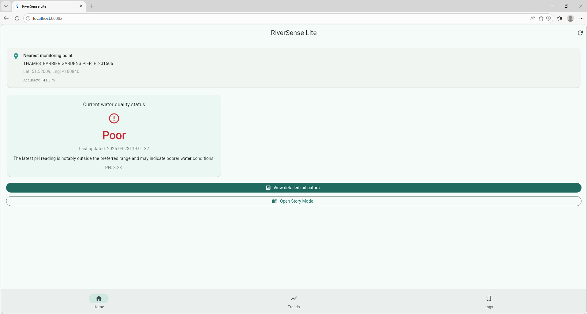

# RiverSense Lite

Making urban water quality visible and understandable through location, public environmental data, trend visualisation, storytelling, and cloud-based log saving.

---

## Project Overview

RiverSense Lite is a Flutter-based mobile application designed to help the public understand urban river water quality more easily.

Urban water-quality data is often available through public monitoring systems, but it is usually presented in technical formats that are difficult for non-expert users to interpret. RiverSense Lite addresses this gap by combining GPS-based location awareness, public environmental API data, trend charts, narrative explanation, and cloud-based log saving.

The app translates environmental readings into a more accessible mobile experience, allowing users to check nearby river conditions, explore recent trends, understand the meaning of readings, and save records for future reference.

---

## Problem Statement

Urban river water quality data often exists, but public understanding does not always follow.

For most users, raw monitoring values and environmental indicators are difficult to interpret without technical knowledge. This makes it harder for the public to connect environmental monitoring data with real-world awareness and action.

RiverSense Lite was developed to make water-quality data:
- easier to access
- easier to interpret
- easier to remember
- more meaningful in everyday urban contexts

---

## Why This Project Fits Mobile Systems and Interactions

This project is designed around the strengths of mobile systems:

- it uses device GPS/location functionality
- it supports repeated, in-situ interaction in urban space
- it integrates external environmental monitoring APIs
- it uses multiple app views and user-centred mobile interaction
- it uses Firestore as a cloud-backed storage layer for saved logs

This makes the project a strong fit for the Mobile Systems and Interactions coursework theme.

---

## Core Features

- **Automatic GPS-based location detection**  
  Detects the user’s location and uses it as the basis for environmental lookup.

- **Nearby river monitoring point lookup**  
  Finds a nearby relevant monitoring point using public environmental data sources.

- **Real-time water quality retrieval**  
  Retrieves water-quality data through the UK Environment Agency Hydrology API.

- **Public-facing status translation**  
  Converts technical water-quality readings into simple labels such as:
  - Good
  - Moderate
  - Poor

- **Historical trend visualisation**  
  Displays historical pH data through a chart for 24-hour / 7-day / 30-day windows.

- **Dynamic Story Mode**  
  Generates a short narrative explanation of the current water-quality condition.

- **Cloud-based saved logs**  
  Allows records to be saved and retrieved using Cloud Firestore.

---

## Screenshots

### Home Page


### Trends Page


### Story Mode


### Logs Page


---

## Demo


---

## User Journey

A typical user journey in RiverSense Lite is:

1. Open the app
2. Allow GPS/location access
3. View the nearest monitoring point and current water-quality status
4. Explore historical trends
5. Open Story Mode for a narrative explanation
6. Save the current record
7. Review saved records in the Logs page

This flow is intended to move from **raw environmental data** to **public understanding**.

---

## Design Approach

The app was designed around three principles:

### 1. Clarity over technical complexity
Instead of showing only raw values, the app translates readings into more understandable status categories and explanations.

### 2. Mobile-first interaction
The design assumes that users interact briefly and contextually while moving through urban space.

### 3. Storytelling as interpretation
Story Mode acts as a bridge between technical environmental monitoring data and everyday public meaning.

---

## Technical Stack

- **Flutter**  
  Cross-platform mobile application development

- **Dart**  
  Core language used to build the app

- **Geolocator**  
  Used for GPS/location detection

- **HTTP**  
  Used to request public environmental API data

- **fl_chart**  
  Used to display historical water-quality trends

- **Firebase Core**  
  Initializes Firebase services in the app

- **Cloud Firestore**  
  Used to save and retrieve user-selected water-quality records

- **UK Environment Agency Hydrology API**  
  Used as the main public data source for monitoring information

---

## Data Flow

The app currently follows this workflow:

1. The app requests user location
2. A nearby relevant monitoring point is identified
3. Water-quality data is requested from the Hydrology API
4. Raw readings are translated into user-facing status labels
5. Historical readings are visualised in the Trends page
6. Story Mode generates a narrative explanation
7. Users can save selected records to Firestore
8. Saved records are shown in the Logs page

---

## Firebase / Firestore

This prototype uses **Cloud Firestore** to store saved water-quality records.

Saved logs include:
- station name
- translated status label
- parameter name
- raw reading value
- unit
- last updated time
- trend summary

The Logs page reads these saved records from Firestore in real time.

---

## Running the App

### Requirements
- Flutter SDK
- Firebase configured with `flutterfire configure`
- Firestore database created in Firebase Console
- Internet connection for API and Firestore access

### Run locally

```bash
flutter pub get
flutter run
```

## Limitations
- Current status is mainly based on pH
- 24-hour trend data may be unavailable for some stations
- Firestore loading may be slower on web

## Future Improvements
- Multi-indicator logic
- Better nearest station matching
- Notifications
- Improved UI polish


